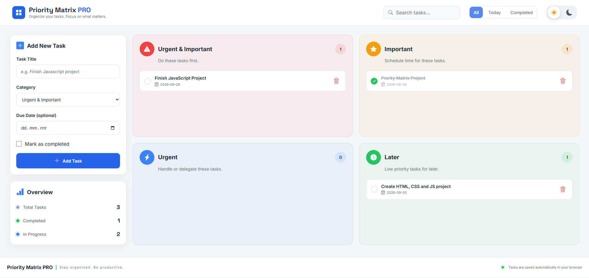

<div align="center">

# ✅ Priority Matrix PRO

A modern priority task manager built around the Eisenhower Matrix.

Organize tasks by importance and urgency, track completed work, search and filter tasks, and keep everything saved directly in your browser.


[Live Demo]()

</div>

---

## 📸 Preview



---

## ✨ Features

- Add new tasks
- Four priority categories
  - Urgent & Important
  - Important
  - Urgent
  - Later
- Optional due dates
- Mark tasks as completed
- Delete tasks
- Search tasks in real time
- Filter tasks by:
  - All
  - Today
  - Completed
- Dynamic task counters
- Overview statistics
  - Total Tasks
  - Completed
  - In Progress
- Automatic Local Storage saving
- Light / Dark mode
- Responsive design
- Modern dashboard-style UI

---

## 🧠 How It Works

Every task is stored as an object inside the application's main `cards` array.

Example:

```js
{
  id: 1727530000000,
  title: "Finish JavaScript project",
  category: "urgent-important",
  date: "2026-09-28",
  completed: false
}
```

When a task is added, updated or deleted, the application:

```text
Updates state
↓
Saves data to Local Storage
↓
Renders the tasks again
↓
Updates statistics and category counts
```

Tasks are rendered into one of four priority sections depending on their category.

---

## 🛠️ Technologies

- HTML5
- CSS3
- Vanilla JavaScript
- Bootstrap Icons
- Google Fonts
- Local Storage API

No frameworks or external JavaScript libraries are used.

---

## 📚 What I Learned

This project helped me practice and understand:

- Managing application state with arrays and objects
- Creating task objects dynamically
- Working with `push()`
- Working with `filter()`
- Working with `find()`
- Using `.length` for dynamic statistics
- Rendering JavaScript data into the DOM
- Creating DOM elements with `document.createElement()`
- Using `appendChild()`
- Working with `dataset`
- Event delegation
- Search filtering with `includes()`
- Updating task completion states
- Removing items from arrays
- Saving and loading data with Local Storage
- Creating reusable helper functions
- Managing light and dark themes
- CSS Grid and `grid-template-areas`
- Nested CSS Grid layouts
- Responsive dashboard design

---

## 💾 Local Storage

Tasks are automatically saved in the browser using:

```js
localStorage;
```

This means tasks remain available after refreshing or reopening the page.

The selected theme is also stored locally.

---

## 📁 Project Structure

```text
priority-matrix-pro/
│
├── index.html
├── style.css
├── script.js
├── LICENSE
├── README.md
│
└── images/
    └── preview.png
```

---

## 🚀 Run Locally

Clone the repository:

```bash
git clone https://github.com/JohnYisBackk/priority-matrix-pro.git
```

Open the project folder and run:

```text
index.html
```

in your browser.

No installation or build process is required.

---

## 👨‍💻 Author

**Samuel Jahn**

- GitHub: [@JohnYisBackk](https://github.com/JohnYisBackk)
- Portfolio: [samueljahn.sk](https://samueljahn.sk)

---

## 📄 License

This project is licensed under the MIT License.

Copyright © 2026 Samuel Jahn

---

<div align="center">

Built with HTML, CSS & Vanilla JavaScript 🚀

</div>
